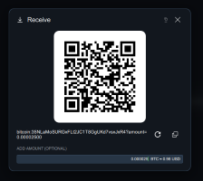

# wikiSpyder

Advanced Wikipedia Search Tool

> [!IMPORTANT]
> **Codename: Michelle**
>
> wikiSpyder 0.9.2 is the Michelle build.

# ABOUT wikiSpyder
The goal of this app/utility is to assist users, researchers and investigators of any kind, as well as students, journalists, or anyone who likes to use Wikipedia while searching for information. 
What it will do is scrape the REFERENCES section posted last in most Wikipedia search result pages. After which wikiSpyder can be deployed to crawl the URLs (websites) or the list of links that were scraped from the REFERENCE sections.
While on the hunt, it will search for user provided search terms, keep a tally of how many times the search terms was found on the landing page of each link, notify the user of which page each search terms was found, and list how many times a search terms was found per visited URL.

It can speed up the search process considerably for working professionals or anyone who may know precisely what information they are looking for if the information (search terms) is linked or appears on the landing page of the targeted URLs.
From there the user can peruse an additional manifest of links annotated with a count of how many times each search terms(s) was found per link along with the tallied search term.
If you like, wikiSpyder will continue to crawl until you've narrowed down the site with the information you were looking for.


- Sites where no search termss were found, or anomalies where the landing page is mostly video or audio presentations are marked as NULL. They can still be accessed manually for eyes-on investigations. Just click the highlighted link to explore with your browser.

- wikiSpyder has a button which will release it to crawl recursively into each listed website if permitted or plausible, and as deep as the target will allow.

- Additional sources (i.e.. URLs, web addresses) can be added/removed before and during deployments.

- wikiSpyder can save all images automatically, if Save Images is checked.

- For now, all data pulled by wikiSpyder which isn't saved is purged once the program is exited.

# Installation

wikiSpyder 0.9.2, Codename Michelle, targets **Python 3.12**.

Clone the repository and create a virtual environment:

```bash
git clone https://github.com/odioski/wikiSpyder.git
cd wikiSpyder
python3.12 -m venv venv
source venv/bin/activate
python -m pip install --upgrade pip setuptools wheel
python -m pip install -r requirements.txt
```

Run directly from the checkout:

```bash
python main.py
```

Optional: install the local package and launch it through the console entry point:

```bash
python -m pip install .
wikiSpyder
```

If using Visual Studio Code, open the workspace file:

```bash
code wikiSpyder.code-workspace
```

## Local release checks

Before cutting a release, run:

```bash
venv/bin/python -m py_compile __main__.py main.py newwindow.py setup.py
venv/bin/python -c "import main, newwindow"
QT_QPA_PLATFORM=offscreen venv/bin/python -c "from PyQt6.QtCore import QTimer; from PyQt6.QtWidgets import QApplication; import main; app = QApplication([]); window = main.MainWindow(); window.show(); QTimer.singleShot(0, window.close); QTimer.singleShot(0, app.quit); raise SystemExit(app.exec())"
```

Then do a quick manual pass in the GUI:

- launch the app
- fetch references from a known Wikipedia page
- run **Deep Probe**
- open **View Images**
- confirm closing the app clears temporary downloaded images

# Gifts

If you'd like to buy me a cup of coffee that would be very kind of you.

Donations are accepted here: PAYPAL | If you'd like to remain TOTALLY anonymous it's completely UNDERSTOOD by me. Such proceeds are accepted here: BITCOIN WALLET.

<span style="width: 50px, height: 50px;"></span>

If you would like to see additional features added or have a suggestion, you can send me a note: score+@bookmotives.com


...
